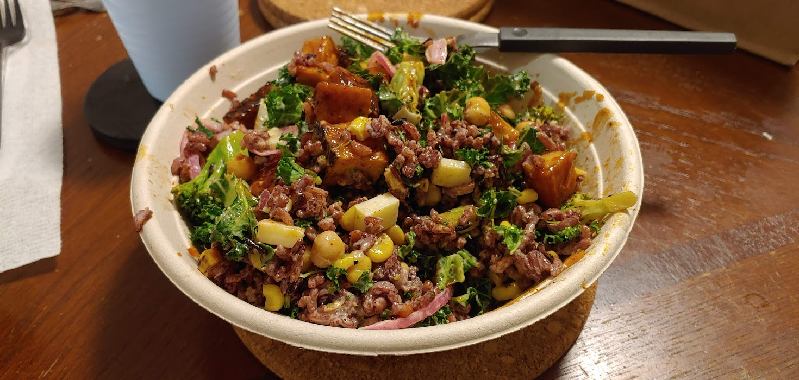

# How to Make a Grain Bowl

Grain bowls are a delicious, nutritious, and filling meal. They typically contain a grain such as rice or quinoa as a base and a protein along with other tasty additions. 

## Ingredients
* 1/3 cup brown rice 
* 1/3 cup broccoli
* 1/3 block firm tofu
* 1/3 cup canned chickpeas
* 1/2 avocado
* water

## Materials Needed
* Knife
* Bowl
* Strainer
* Pot 
* Baking sheet
* Stove
* Oven

### Warning: Take precaution when using the knife, stove and oven. Misuse of these items can cause injury. 

## Instructions 
1. Preheat oven to 350 degrees Fahrenheit.  
2. Rinse brown rice in strainer. 
3. Remove chickpeas from can and drain water. 
4. Cut broccoli and avocado into small pieces using knife. 
5. Cut tofu into small squares using knife. 
6. Place rice in pot and fill with water until rice is completely submerged. 
7. Place pot on stove and set heat to 'medium'. Let rice cook for 20 minutes, or until it is sufficiently soft. 
8. When the oven has finished preheating, place broccoli, chickpeas and tofu on baking pan and place in the oven. For extra flavor, add olive oil and salt onto the broccoli. Leave in oven for 30 minutes. 
9. When all items are finished cooking, mix into bowl. 
10. Enjoy your meal!

